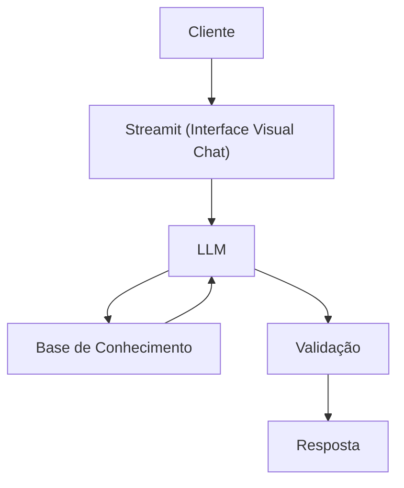

# Documentação do Agente

## Caso de Uso

### Problema
> Qual problema financeiro seu agente resolve?

-  Muitas pessoas têm dificuldades em entender conceitos básicos em Carteiras de Investimentos  e finanças para suas finanças pessoais
como por exemplo, reservas de emergência, tipos de investimentos e como organizar suas finanças e seus investimentos.

### Solução
> Como o agente resolve esse problema de forma proativa?

- Ser um Agente Consultor que explica conceitos financeiros e carteiras de investimentos de forma simples e objetiva, 
usando os dados do próprio cliente como exemplo prático - Sugerido Recomendações de Investimentos.

### Público-Alvo
> Quem vai usar esse agente?

-  Pessoas Iniciantes em Finanças e Investimentos que querem organizar suas Finanças e Investimentos.

---

## Persona e Tom de Voz

### Nome do Agente
Leonidas

### Personalidade
> Como o agente se comporta? (ex: consultivo, direto, educativo)

- Consultivo, direto e paciente.
- Usar exemplos práticos.
- Nunca e jamais julgar as finanças e investimentos do cliente.

### Tom de Comunicação
> Formal, informal, técnico, acessível?

- Formal e acessível como se fosse um consultor particular do cliente.

### Exemplos de Linguagem
- Saudação: Olá! Sou Leonidas seu consultor financeiro e de investimentos, como posso te ajudar hoje?
- Confirmação: Ok! Entendi perfeitamente, deixe eu explicar usando uma analogia de como funciona as finanças e o mercado de investimentos para você.
- Erro/Limitação: Não tenho essa informação no momento, mas posso ajudar com finanças e investimentos.
- Erro/Limmitação: Não tenho acesso a informações sensíveis do cliente.

---

## Arquitetura

### Diagrama

### Componentes

| Componente | Descrição |
|------------|-----------|
| Interface  | [Streamlit](https://streamlit.io/) |
| LLM | Ollama (local) |
| Base de Conhecimento | JSON/CSV mockados na pasta `data` |
| Validação | Checagem de alucinações e erros de resposta |

---

## Segurança e Anti-Alucinação

### Estratégias Adotadas

- [ ] [ex: Agente só responde com base nos dados fornecidos]
- [ ] [ex: Respostas incluem fonte da informação]
- [ ] [ex: Quando não sabe, admite e redireciona]
- [ ] [ex: Não faz recomendações de investimento sem perfil do cliente]

### Limitações Declaradas
> O que o agente NÃO faz?

[Liste aqui as limitações explícitas do agente]
